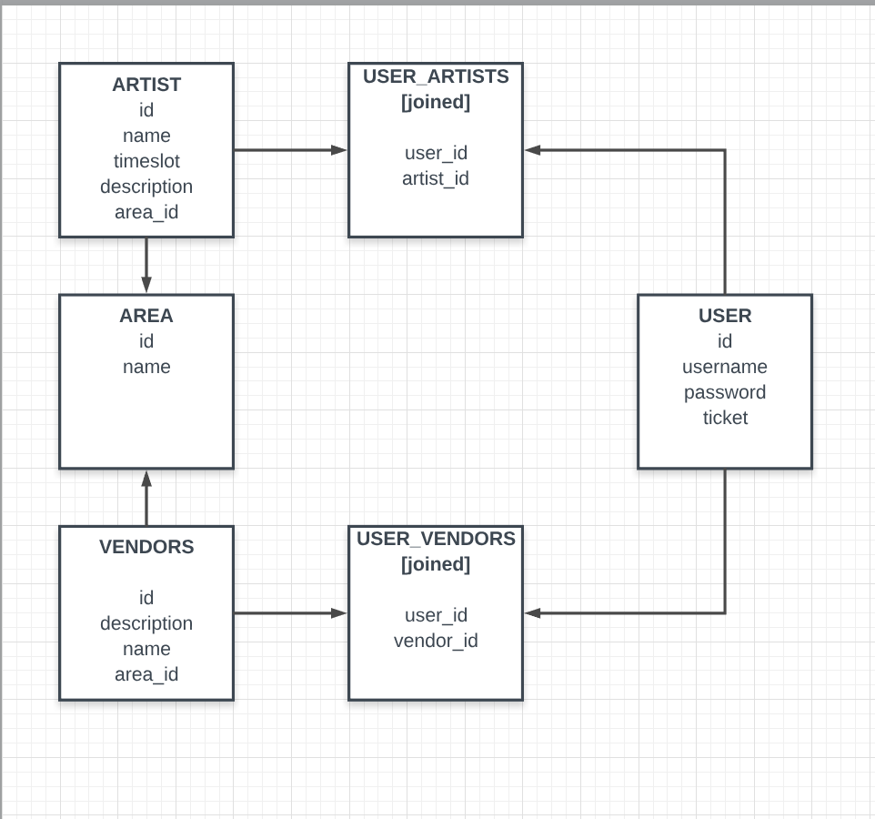

# codechella
A sample music festival page using React/Express front/back-end.

### Back-End Construction

_[fig. 1] Database Format in PostgreSQL_

The back-end for this project is constructed with _PostgreSQL_ for the database, as well as _Express_ and _Sequelize_ for the server.

Each __area__ has several __artists__, as well as several __vendors__. A given __user__ can save their favorites of any of these categories.

## Views / Component Hierarchy

### MVP

#### Navigation Bar
- contains _Home_, _Map_, _Artists_, _Vendors_, _Areas_, _Tickets_ as well as a _Login/Register_

#### Artists
- _ArtistList_: list of _Artist_ components
- _Artist_: rendered version of _Artist_ entries
- _ArtistDetail_: modal details about artist

#### Vendors
- _VendorList_: list of _Vendor_ components
- _Vendor_: rendered version of _Vendor_ entries
- _VendorDetail_: modal details about vendor

#### Areas
- _AreaNav_: nav to switch between different Areas
- _Area_: Picture, description.
- _Schedule_: Schedule of different artists (extends ArtistList).

#### Login/Register
- _Login_: Login option.
- _Register_: Register option.
- _RegisterDetail_: Registering Menu
- _Profile_: User information, tickets bought.

### POST-MVP

#### Map
- _Map_: Clickable picture that links to different area views.

#### Tickets
- _Tier_: Details on ticket tiers, upon clicking (if logged in) will take you to cart. Else, it will take you to register.

#### Timeline
1. Monday
  1. seed.js
  2. resetDb.js
  3. models.js
  4. server.js
  5. routes
    1. Users (artists, vendors, areas)
    2. Artists
    3. Vendors
    4. Areas
2. Tuesday
  1. Artists View
  2. Vendors View
  3. Area View
  4. Navigation
3. Wednesday (MVP)
  1. Login/Register
  2. Styling
4. Thursday
  1. Map
  2. Tickets
  3. Styling
